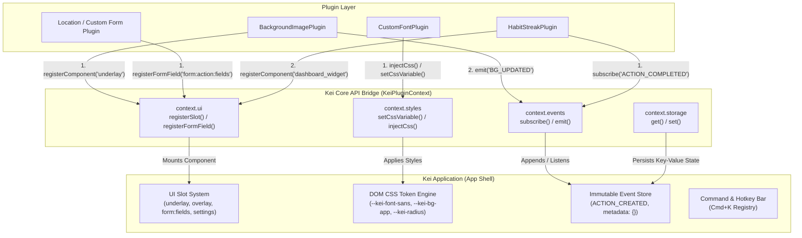

# Plugin-Driven Architecture

## Why Plugins

This idea arised after refactoring first version of software. It was harder to maintain. AI slope is real. Code boundaries are hard to maintain. App becomes opinionated to serve only those who are pleased.

It is, of course, fine. However, if good version of app is developed and after some time it seems to lack some features, like UI modes. It would need to affect all users.
Point is that it will have a new `refactor/` branch with breaking changes.

## Solution

Solution was over there all the time.

- "[Browser extensions](https://developer.mozilla.org/en-US/docs/Mozilla/Add-ons/WebExtensions)" - are best example of how to software becomes customizable and enables core developers focus on app, while enabling users to customize experience.
- "[GNOME Extensions](https://extensions.gnome.org/)" - the same idea, but on OS level.

## What is exactly plugin? What is it for?

A **Plugin** in Kei is a modular, self-contained extension packaged with a manifest (`plugin.json`) and a lifecycle script (`activate()` / `deactivate()`). It connects to Kei via the typed `KeiPluginContext` bridge API.

### Primary Purpose

1. **Keep Core Zero-Bloat**: Maintain a minimal, fast core application that handles event storage and essential scheduling, avoiding feature creep.
2. **Empower Personalization**: Allow users to craft their own productivity workflows (Vim keybindings, Eisenhower view, habit trackers) without imposing opinions on others.
3. **Enable Rapid Experimentation**: Test new feature domains (e.g., habit apps, workout logs) as plugins without breaking changes or launching separate codebases.

---

### What can Plugin do and what not? What should it do? What should it not?

#### What a Plugin CAN Do (Capabilities)

- **Subscribe to & Emit Events**: Observe incoming events (`ACTION_COMPLETED`) and emit new state events (`HABIT_STREAK_INCREMENTED`).
- **Register UI Extensions**: Inject components into declared slot areas (Dashboard Widgets, Sidebar Tabs, Custom Form Fields, Custom Views).
- **Register Commands & Shortcuts**: Add actions to the central command palette (`Cmd+K`) and keybinding listeners.
- **Manage Private Storage**: Read and write plugin-scoped state via `context.storage`.
- **Introduce New Event Domains**: Register new resource tags (`resource: "habit"`, `resource: "workout"`) on the generic event store.

#### What a Plugin CANNOT Do (Security & System Boundaries)

- **No Direct Storage Mutations**: Cannot perform raw DB deletes or bypass the append-only event log. All state changes must be recorded as immutable events.
- **No Arbitrary DOM Hacking**: Cannot manipulate unexposed core DOM elements outside declared extension slots.
- **No Unpermitted Network or OS Access**: Cannot make external HTTP requests or access native filesystem APIs without explicit manifest permissions approved by the user.
- **No Main Thread Blocking**: Long-running background jobs (e.g. local WebLLM or batch processing) must execute off the main thread in background workers.

### Examples

- **Theme & UI Customization**: Light/dark themes, custom font sizing, focus mode.
- **Vim / Keyboard-First Experience**: Keybindings, modal navigation, command palette actions (`Cmd+K`).
- **Custom Views & Forms**: Eisenhower Matrix (Urgent vs Important), Kanban task boards, Timeline/Gantt views.
- **Event Hooks & Automations**:
  - Pre-meeting prep automation (e.g., auto-generate prep notes when a calendar event is created).
  - Local AI agent hooks (auto-tagging tasks, breaking down complex tasks via WebLLM/Ollama).
  - Energy & Focus auditing (tracking high-energy vs low-energy time blocks).
- **Integrations & Sync Adapters**:
  - Google Calendar / Notion / Obsidian Markdown Vault sync.
  - Peer-to-Peer sync (WebRTC / Yjs) — keeping core lightweight while enabling E2EE sync as a plugin module. ??? Should it be here?
  - Freenet?
- **Dynamic Schema & Custom Form Fields**:
  - Custom field components (location map picker, attachments, duration timers, expense tags).
  - Custom event templates (habit tracking, daily reflection journal, workout logger).
- **Smart Event Hooks & Local AI Automation**:
  - Local AI Assistant (WebLLM / Local Ollama / Transformers.js):
    - Task Decomposer: On task.created, automatically generate suggested sub-tasks.
    - Auto-Preparation Hook: On meeting.created, gather linked notes or recent topics into a prep sheet.
    - Conflict & Burnout Warning: Trigger warnings on event.created if overlapping slots or excessive continuous focus time is detected.
    - Context & Weather Integration: Append local weather forecasts or transit estimates to location-based calendar events via local background hooks.
- **Kei API / Webhooks (External Integrations)**:
  - External Service Triggers: Allow a plugin to register an HTTP webhook endpoint that Kei calls when specific events occur (e.g., when an event is completed).
  - Custom Request Builders: Provide a UI/API for plugins to define custom HTTP requests (URL, headers, body templates using event data) to send to external APIs (e.g., logging to a private API, updating a Notion page).

- **Alternative Visual Views & Custom UI Widgets**:
  - Eisenhower Matrix View: A plugin registering a custom view tab sorting tasks by Urgent vs. Important.
  - Kanban & Timeline (Gantt) Views: Alternative views derived from the underlying event log without altering core storage models.
  - Custom Dashboard Widgets: Extensible slot components in the dashboard (e.g., Quick Scratchpad, Habit Streak Counter, Daily Quote).
  - Command Palette Extensions (Cmd+K): Allow plugins to register custom quick-actions or search providers into a central fuzzy-finder command bar.
- auto clean up plugins
- Smart Time Actions
  - Show journal input in the morning
  - Reflect idea
- Habits
- Preview functionality
- Background image
- Less input. new era AI input! ??

## How does it work?

### 1. Plugin Architecture & Connection Modes

We adopt a **Hybrid Model (Obsidian/VS Code style)** with two distinct plugin levels:

- **Web / Frontend Plugins (External)**:
  - Run in an isolated Web Worker or Sandboxed Context inside the WebView.
  - Communicate with Kei via a typed Event & UI Bridge API (`KeiPluginContext`).
  - Cannot access arbitrary DOM or file system APIs directly.
- **Root / Engine Plugins (System Level)**:
  - Low-level network & sync adapters (e.g. Peer-to-Peer WebRTC sync, Freenet, Obsidian vault file watching).
  - Implemented as storage adapters directly plugging into `EventStoreSyncAdapter`.

### 2. Tauri Native Application Integration

When Kei runs as a native desktop application using **Tauri**:

- **Dynamic Local Plugin Directory**: Tauri allows reading user plugins dynamically from `~/.config/kei/plugins/` (or `%APPDATA%/kei/plugins/`) using Tauri's filesystem APIs.
- **Native IPC Bridge**: If a plugin has the required permission (`network:fetch`, `os:notification`, `os:tray`), it makes safe IPC calls to Tauri Rust commands:
  ```
  Web UI Plugin  --->  Kei JS Bridge  --->  Tauri IPC  --->  Rust Backend / OS
  ```
- **Crash Isolation**: Because web extensions run in the WebView worker and native features use Tauri permission guards, a failing plugin cannot crash the main native window.

---

## Plugin Rules & Sandbox Model

To ensure security, performance, and long-term maintainability:

1. **Manifest File (`plugin.json`)**: Every plugin must include a manifest declaring metadata and explicit permissions (`events:subscribe`, `events:emit`, `storage:local`, `ui:widget`, `network:fetch`).
2. **Append-Only Event Store Contract**: Plugins cannot perform direct raw SQL/IndexedDB mutations or state deletions. Plugins **subscribe to events** (`ACTION_COMPLETED`) and **emit new events** (`HABIT_STREAK_INCREMENTED`).
3. **Declared UI Slots**: Plugins register widgets into declared core UI slots (`dashboard_widget`, `command`, `sidebar_tab`).
4. **Independent Lifecycle**: Plugins implement `activate(context)` and `deactivate()` methods. Disabling a plugin cleanly unmounts UI slots without corrupting the historical event log.

---

## Working Example Plugin

See plugin implementations in the monorepo:

- [packages/plugin-sample](file:///home/munlicode/src/kreozalabs/kei/packages/plugin-sample): Reference implementation (`HabitStreakPlugin`) — listens to `ACTION_COMPLETED`, updates local plugin storage, emits `HABIT_STREAK_INCREMENTED`, and registers a dashboard widget.
- [packages/plugin-background-image](file:///home/munlicode/src/kreozalabs/kei/packages/plugin-background-image): Customization plugin (`BackgroundImagePlugin`) — handles wallpaper presets, custom URLs, backdrop blur, overlay opacity, and persistent plugin storage.
- [packages/plugin-custom-font](file:///home/munlicode/src/kreozalabs/kei/packages/plugin-custom-font): Customization plugin (`CustomFontPlugin`) — handles Google Fonts presets, custom font families, font scale multipliers, monospace code fonts, dynamic DOM stylesheet injection, and multi-plugin interplay.

---

## Plugin Connection & Distribution Methods

How are plugins connected to Kei in practice? We support **4 Connection Channels**:

```
+-----------------------------------------------------------------------+
|                             KEI CORE                                  |
+-----------------------------------------------------------------------+
        ^                       ^                   ^                ^
        |                       |                   |                |
 [Monorepo Package]    [Local Directory]      [HTTPS URL]    [Registry Index]
 (Official Plugins)    (~/.config/kei)         (CDN / npm)   (1-Click Market)
```

### 1. Official Core Plugins (Monorepo)

- **Location**: Inside `packages/plugin-*` (e.g., `@kreozalabs/kei-plugin-habit-streak`).
- **Connection**: Shipped directly with Kei or lazy-loaded via dynamic import (`import('@kreozalabs/kei-plugin-xxx')`).
- **Use Case**: Core themes, default Eisenhower Matrix view, official Google Calendar sync.

### 2. Local Folder Plugins (Offline / Desktop / Tauri)

- **Location**: User local filesystem directory (`~/.config/kei/plugins/<plugin-id>/`).
- **Connection**: At startup, Kei scans the directory, reads `plugin.json`, and dynamically imports `dist/index.js` into the plugin worker sandbox.
- **Use Case**: Offline power-users, personal automations, and local plugin development without publishing.

### 3. Remote URL / CDN Plugins (Web & Desktop)

- **Location**: Hosted on any HTTPS URL (e.g., GitHub Releases, npm via jsDelivr, unpkg).
- **Connection**: User pastes a plugin URL -> Kei downloads `plugin.json` + `index.js` -> caches it in IndexedDB / local disk -> prompts user for manifest permissions -> loads plugin in sandbox.
- **Use Case**: Independent developers sharing plugins via GitHub repos without needing central store approval.

### 4. Open Community Registry (`community-plugins.json`)

- **Location**: A public JSON index file hosted on GitHub (e.g., `kreozalabs/kei-plugins-registry`).
- **Connection**: Kei fetches the curated registry index -> displays a **Plugin Marketplace UI** inside settings -> users click **Install** to auto-download, verify checksum hash, and manage updates.
- **Use Case**: Seamless discovery for end-users to browse and install community plugins safely.

## Design


